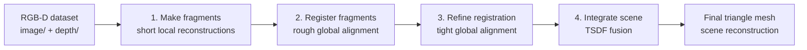
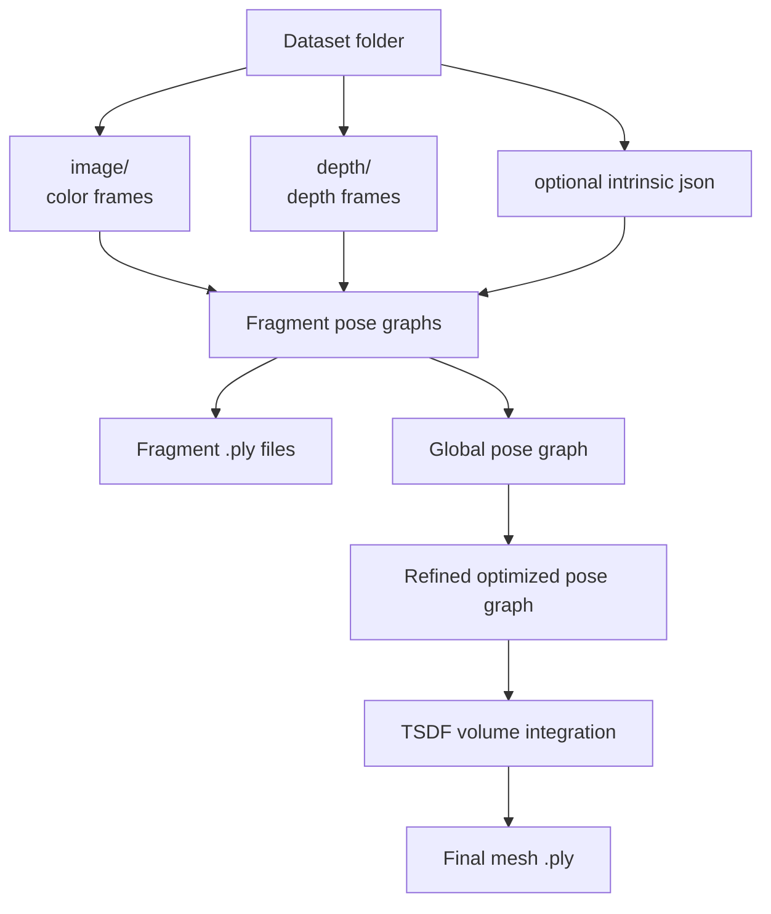
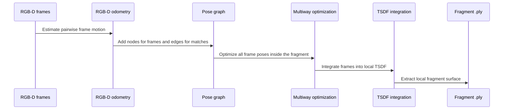
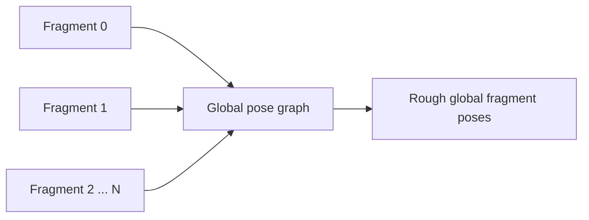
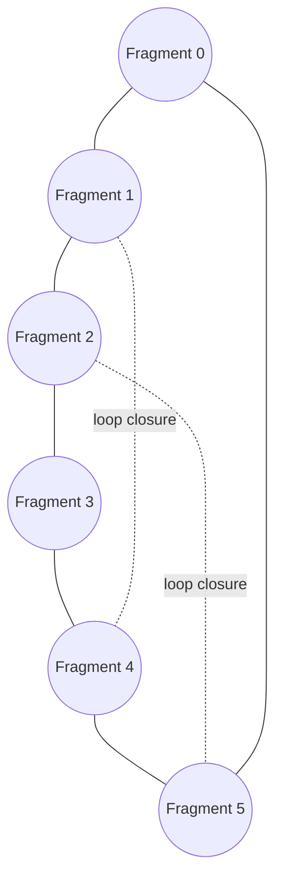
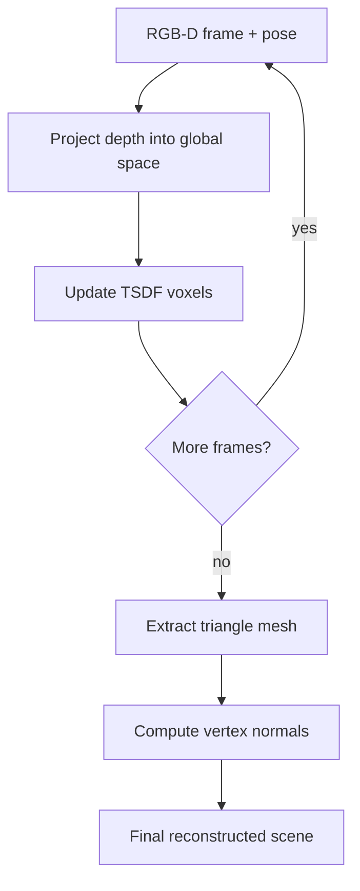
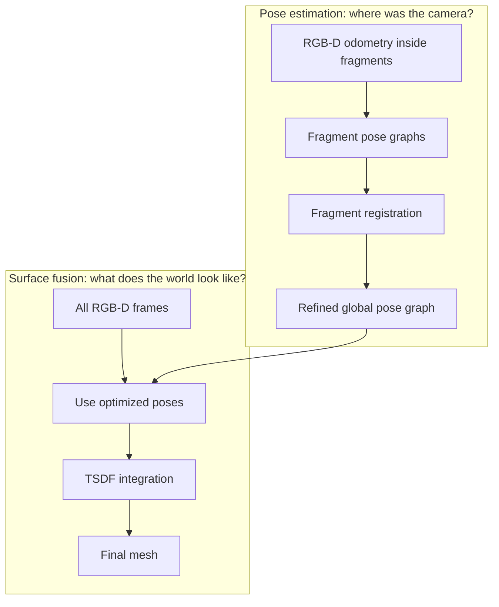

# Open3D Reconstruction System, Explained Simply

This note explains the Open3D RGB-D reconstruction tutorial pages:

- [System overview](https://www.open3d.org/docs/latest/tutorial/reconstruction_system/system_overview.html)
- [Make fragments](https://www.open3d.org/docs/latest/tutorial/reconstruction_system/make_fragments.html)
- [Refine registration](https://www.open3d.org/docs/latest/tutorial/reconstruction_system/refine_registration.html)
- [Integrate scene](https://www.open3d.org/docs/latest/tutorial/reconstruction_system/integrate_scene.html)

The big idea: Open3D takes many RGB-D frames, estimates where each frame was captured from, aligns everything into one coordinate system, then fuses the depth/color data into a final 3D mesh.

## The Whole Pipeline



Open3D's full reconstruction system has four main stages:

1. `--make`: create local fragments from short chunks of the RGB-D sequence.
2. `--register`: align fragments into one global space and detect loop closures.
3. `--refine`: improve rough fragment-to-fragment alignments.
4. `--integrate`: fuse all RGB-D frames into a TSDF volume and extract the mesh.

The command shown in the overview runs all major stages:

```bash
python run_system.py --make --register --refine --integrate
```

Even though your links skip the separate "Register fragments" page, that stage sits between `make` and `refine`. Without it, `refine` would not know which fragment pairs are likely matches.

## Mental Model

Imagine scanning a room with an RGB-D camera.

Each frame gives:

- RGB image: what the camera sees in color.
- Depth image: how far each visible pixel is from the camera.
- Camera intrinsics: how pixels map into 3D rays.

But one frame only sees a small part of the room. The reconstruction system asks:

- How did the camera move between frames?
- Which frames or fragments overlap?
- How do we place every observation into one shared 3D coordinate system?
- Once all poses are known, how do we merge all depth maps into one clean surface?

## Data And Outputs



The dataset is expected to contain synchronized and registered `image` and `depth` folders. If `path_intrinsic` is not configured, Open3D uses the PrimeSense factory camera settings. For your own camera, providing the correct intrinsics matters a lot; wrong intrinsics bend the geometry before registration even begins.

## Page 1: System Overview

The overview page is the map of the full reconstruction workflow.

Open3D describes the reconstruction system as four stages:

| Stage | Command flag | Purpose | Main techniques |
|---|---:|---|---|
| Make fragments | `--make` | Build local surfaces from short RGB-D subsequences | RGB-D odometry, multiway registration, RGB-D integration |
| Register fragments | `--register` | Put fragments into a rough global arrangement and detect loop closure | Global registration, ICP, multiway registration |
| Refine registration | `--refine` | Improve rough alignments so fragments fit tightly | ICP, multiway registration |
| Integrate scene | `--integrate` | Fuse all RGB-D frames and output the final mesh | RGB-D integration / TSDF fusion |

The overview also explains that Open3D includes built-in example datasets such as Lounge, Bedroom, and Jack Jack. You can also use your own RGB-D data if the color and depth frames are synchronized and registered.

Example config fields from the page include:

```json
{
  "path_dataset": "dataset/tutorial/",
  "path_intrinsic": "",
  "depth_max": 3.0,
  "voxel_size": 0.05,
  "depth_diff_max": 0.07,
  "preference_loop_closure_odometry": 0.1,
  "preference_loop_closure_registration": 5.0,
  "tsdf_cubic_size": 3.0,
  "icp_method": "color",
  "global_registration": "ransac",
  "python_multi_threading": true
}
```

What those settings mean in plain language:

- `depth_max`: ignore depth values farther than this.
- `voxel_size`: resolution used for downsampled point clouds and registration.
- `depth_diff_max`: threshold for deciding whether two depth observations are compatible.
- `preference_loop_closure_odometry`: how much to trust loop closure edges inside fragments.
- `preference_loop_closure_registration`: how much to trust loop closure edges between fragments.
- `tsdf_cubic_size`: physical size of the volume used for TSDF integration.
- `icp_method`: registration method, commonly color-aware ICP in this tutorial.
- `global_registration`: coarse matching method, such as RANSAC.
- `python_multi_threading`: parallelize work with `joblib`.

## Page 2: Make Fragments

This is the first real processing step:

```bash
python run_system.py [config] --make
```

It takes the full RGB-D sequence and cuts it into smaller chunks called fragments. A fragment is a local 3D reconstruction made from a short range of frames.

Why fragments exist:

- Registering every frame against every other frame would be expensive.
- Camera tracking can drift over long sequences.
- Short chunks are easier to align reliably.
- Later stages can align fragment-level surfaces instead of raw individual frames.

### What Happens Inside A Fragment



Open3D registers RGB-D image pairs. Consecutive frames are treated like odometry edges. Some non-consecutive keyframes are also matched to detect local loop closures.

The result is a pose graph:

- Node: one RGB-D frame pose.
- Edge: a relative transformation between two frames.
- Certain edge: usually neighboring frames from odometry.
- Uncertain edge: usually loop closure or non-neighbor matches.

After building this graph, Open3D runs pose graph optimization. That makes all frame poses in the fragment agree with each other as much as possible. Then Open3D integrates those frames into a local surface and writes a fragment `.ply`.

### Key Output

For each fragment, this stage produces:

- Fragment pose graph.
- Optimized fragment pose graph.
- Fragment point cloud or mesh file, usually `.ply`.

This stage answers: "Within this short chunk of frames, where was the camera for each frame, and what local surface did it see?"

## The Missing Middle: Register Fragments

Your links do not include the dedicated "Register fragments" page, but the overview and refine pages rely on it.

After `--make`, Open3D has many local fragments. Each fragment is internally consistent, but the fragments still need to be arranged in the same global scene.

This middle stage does rough fragment alignment:



It tries to match fragment pairs, estimate transformations between them, and detect loop closures. The output is a global pose graph saying how fragments relate to each other.

This stage answers: "Where do all the local fragments belong in the full room?"

## Page 3: Refine Registration

This stage runs with:

```bash
python run_system.py [config] --refine
```

Input requirements:

- A `fragments` folder containing fragment `.ply` files.
- A global pose graph `.json` from the previous registration stage.

The refine page says the main process does two important things:

1. `local_refinement`: performs pairwise registration on fragment pairs detected earlier.
2. `optimize_posegraph_for_scene`: performs multiway registration over the whole scene.

In simple terms, `--register` got the fragments close; `--refine` makes them fit better.

### Fine-Grained Registration

Refinement uses pairwise registration on already-detected matching fragment pairs. Because the fragments are already roughly aligned, ICP can do a better job here than it could from a random starting position.

ICP means "Iterative Closest Point." It repeatedly:

1. Finds corresponding points between two clouds.
2. Estimates a transformation that reduces alignment error.
3. Applies the transformation.
4. Repeats until the alignment stops improving.

With colored ICP, color information also helps guide the alignment, which is useful when geometry alone is ambiguous.

### Scene Pose Graph

The refined scene graph has:

- One node per fragment.
- Odometry edges for neighboring fragments.
- Loop closure edges for non-neighbor fragments that overlap.



Solid edges are the natural scan order. Dotted edges are loop closures: "we came back near something seen earlier."

Open3D may prune false positive edges during optimization. That matters because one bad loop closure can pull the whole reconstruction into the wrong shape. The refine page's sample result mentions valid matching pairs, false positives, pruning, and then another optimization pass for tighter alignment.

This stage answers: "Can we make the fragment placements more accurate and remove bad matches?"

## Page 4: Integrate Scene

This is the final stage:

```bash
python run_system.py [config] --integrate
```

The integration stage takes:

- All RGB-D frames from `image` and `depth`.
- Optimized per-fragment pose graphs from `--make`.
- The optimized global fragment pose graph from `--refine`.
- Camera intrinsics.

Then it computes the global pose of every RGB-D frame.

The important pose composition is:

```text
global_frame_pose = global_fragment_pose * local_frame_pose_inside_fragment
```

Once every frame has a global pose, Open3D integrates each RGB-D image into a `ScalableTSDFVolume`.

### What Is TSDF?

TSDF means Truncated Signed Distance Function.

Plain version:

- Open3D keeps a 3D voxel grid.
- Each voxel stores how far it is from the nearest observed surface.
- "Signed" means one side of the surface is positive and the other is negative.
- "Truncated" means Open3D only stores useful distances near surfaces, not huge far-away distances.
- After all frames are fused, Open3D extracts a triangle mesh from the zero-crossing surface.



In the Open3D snippet, the TSDF volume is created with:

```python
o3d.pipelines.integration.ScalableTSDFVolume(
    voxel_length=config["tsdf_cubic_size"] / 512.0,
    sdf_trunc=0.04,
    color_type=o3d.pipelines.integration.TSDFVolumeColorType.RGB8
)
```

Important pieces:

- `voxel_length`: controls mesh resolution. Smaller voxels give finer detail but cost more memory and time.
- `sdf_trunc`: the distance band around surfaces where TSDF values are stored.
- `RGB8`: stores color in the reconstructed surface.

This stage answers: "Now that we know every camera pose, how do we merge all depth images into one final colored mesh?"

## End-To-End Interpretation

The reconstruction pipeline is really two pipelines stacked together:



Pose estimation comes first because TSDF fusion needs camera poses. If poses are wrong, integration will blur, duplicate, or warp the final mesh.

## Practical Debugging Guide

If the final mesh looks bad, check the pipeline in this order:

| Symptom | Likely cause | Stage to inspect |
|---|---|---|
| Local chunks look broken | Bad depth, wrong intrinsics, poor RGB-D odometry | `--make` |
| Fragments are individually good but globally scattered | Bad rough fragment registration | `--register` |
| Scene almost fits but has double walls or small offsets | ICP refinement or bad loop closures | `--refine` |
| Alignment looks okay but mesh is noisy or melted | TSDF settings, depth scale, depth truncation | `--integrate` |
| Everything is scaled wrong | Camera intrinsics or depth scale issue | Dataset/config |

## Important Terms

| Term | Meaning |
|---|---|
| RGB-D | Color image plus depth image |
| Intrinsics | Camera calibration values that map pixels to 3D rays |
| Odometry | Estimated camera motion between nearby frames |
| Fragment | Local reconstruction from a short sequence of RGB-D frames |
| Pose | Camera or fragment transform in 3D space |
| Pose graph | Graph of poses connected by relative transformation constraints |
| Loop closure | Recognizing that the camera returned to a previously seen area |
| ICP | Local alignment algorithm for point clouds |
| Multiway registration | Optimizing many poses together, not just one pair |
| TSDF | Voxel-based surface fusion representation |
| Mesh | Final triangle surface extracted from the TSDF |

## Short Version

Open3D does not directly turn raw frames into a mesh in one jump. It first solves the "where is every camera/frame/fragment?" problem, then solves the "merge all observations into one surface" problem.

The four stages are:

```text
RGB-D frames
  -> make local fragments
  -> register fragments globally
  -> refine global alignment
  -> integrate all frames into TSDF
  -> final mesh
```

That is the clean mental model to keep in your head while reading or modifying the reconstruction code.
