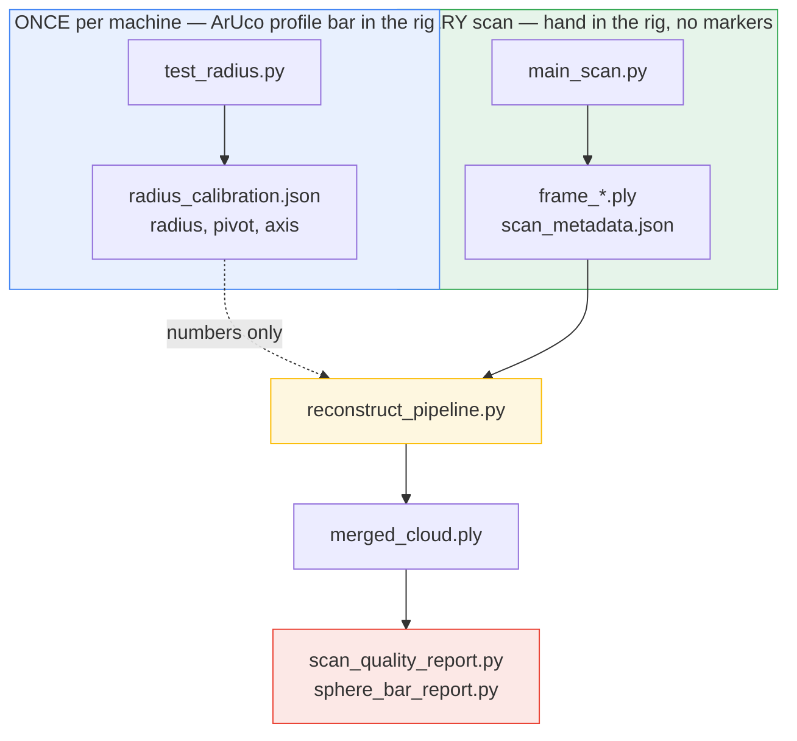
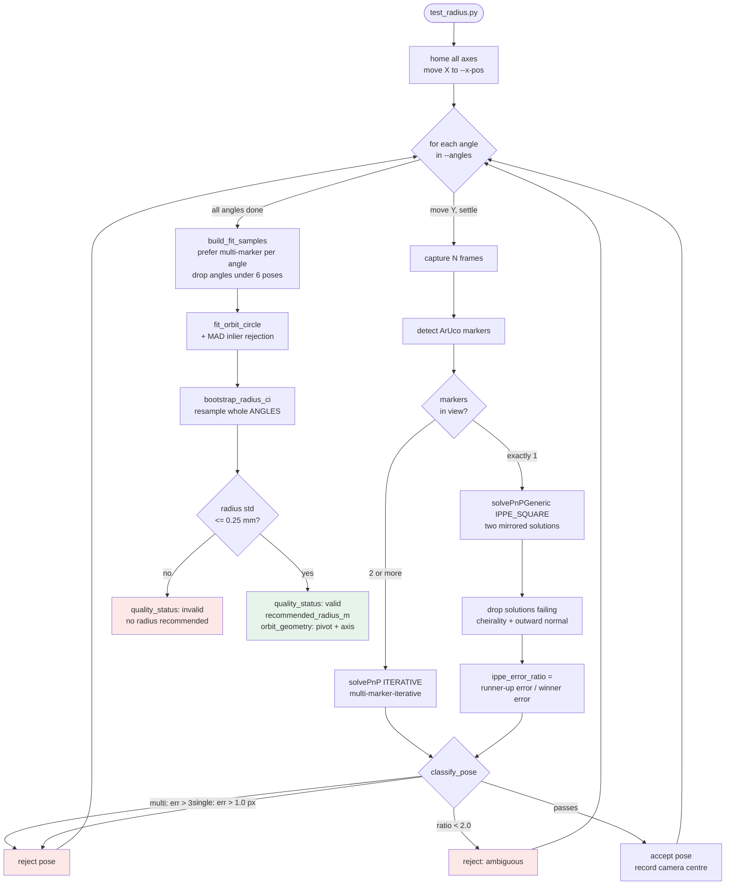
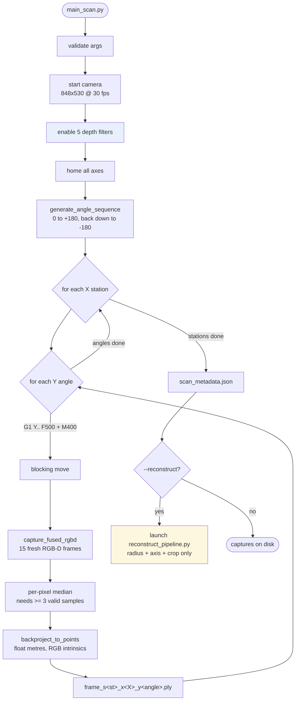
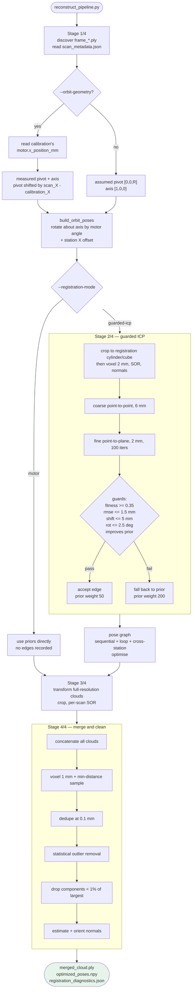
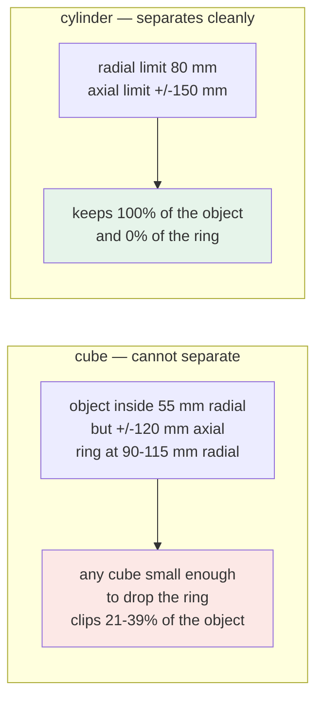
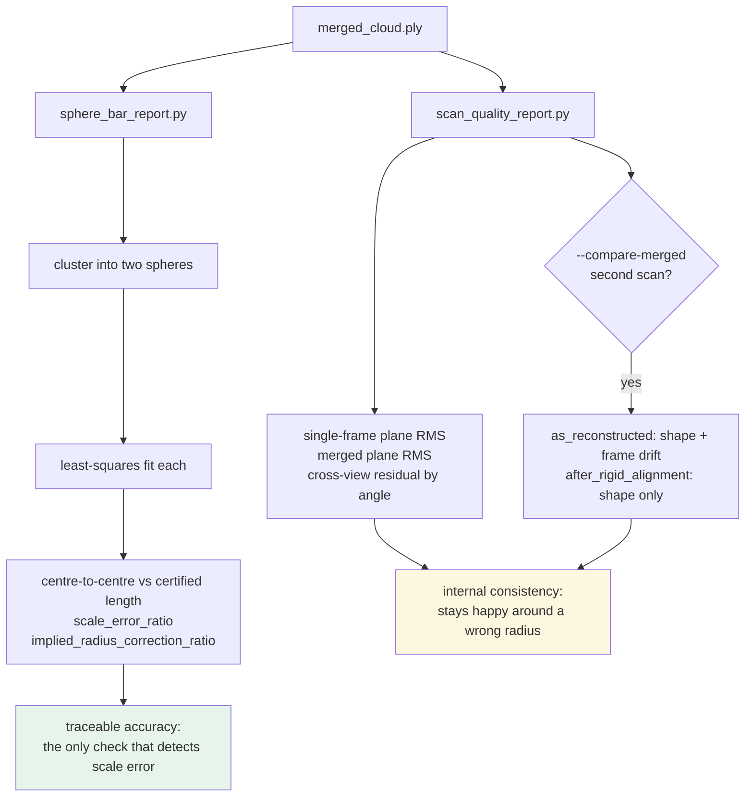

# Synchronized Circular-Scan Workflow — Flow Charts

How the three programs fit together, what each stage produces, and which gates
can stop a run. Prose and parameter tables live in [README.md](README.md); this
file is the map.

**The marker bar and the hand are never in the rig at the same time.**
`test_radius.py` looks at the ArUco bar to measure where the camera travels, and
writes that geometry to a file. `main_scan.py` contains no marker code at all --
it only moves the motor and saves point clouds. Reconstruction reads the
calibration *file*, so a scan never needs a marker in view.

Re-run the calibration only when the mechanics change. **A different X station
does not need its own calibration** -- the radius and axis do not depend on X,
and reconstruction shifts the pivot by the station difference automatically.

---

## 1. Orbit calibration — `calculating_radius/test_radius.py`

Measures where the camera actually travels, by watching a stationary four-face
ArUco profile from many motor angles and fitting a circle to the recovered
camera centres.

**Why the gates are shaped this way.** Reprojection error means different things
on the two solver paths: a single marker gives four coplanar points that IPPE
solves almost exactly, so the error is near zero however wrong the pose is. On
one recorded run the 145 single-marker poses had a 0.124 px median while the 90
better-conditioned two-marker poses had 1.050 px — a shared 1.5 px limit
admitted every single-marker pose and rejected 22 poses, *all* two-marker.
Hence the split thresholds and the ambiguity ratio.

**Why the bootstrap resamples angles.** The frames captured at one angle share
that angle's pose error and are not independent draws. Per-frame resampling
claimed a 0.165 mm mean standard deviation across three runs whose radii
actually spread by 0.324 mm — optimistic by 1.9x.

---

## 2. Capture — `main_scan.py`

**Depth filter chain**, applied to the raw unaligned depth frame *before* D2C
alignment, since the filters assume the native sensor neighbourhood:

Spatial and temporal filters work in the disparity domain, so
`DisparityTransform` converts back to depth after them; the noise-removal
filters then operate on depth. The last two are **not** in the device's
`get_recommended_filters()` list and are constructed directly from the SDK.
`HoleFillingFilter` is deliberately excluded — it invents depth the sensor
never measured.

> `--reconstruct` passes only the scalar radius and axis, never
> `--orbit-geometry`, so the pivot falls back to `[0, 0, R]`. Run
> `reconstruct_pipeline.py` separately to use a measured pivot and axis.

---

## 3. Reconstruction — `reconstruct_pipeline.py`

### Crop geometry

Both crops are centred on each station's orbit pivot. `--crop-shape cylinder`
is strongly preferred on this rig.

Two independent crops: `--registration-crop-radius-m` shapes only the reduced
clouds ICP sees, and `--crop-radius-m` shapes the full-resolution output.
Tightening the registration crop keeps rig geometry out of ICP without
shrinking the result.

---

## 4. Validation

Everything except the ball bar measures the pipeline against itself. A
reconstruction can be perfectly self-consistent around a systematically wrong
orbit radius, and only a certified length detects that.

---

## Where the numbers come from

| Quantity | Produced by | Consumed by |
|---|---|---|
| `orbit_radius_m` | `test_radius.py` | pose priors, crop centres |
| `orbit_geometry.pivot_m` / `.axis` | `test_radius.py` | pose priors, crop centres, merge pivot |
| `frame_*.ply` | `main_scan.py` | reconstruction stages 1 and 3 |
| `optimized_poses.npy` | reconstruction stage 2 | stage 3 transforms |
| `registration_diagnostics.json` | reconstruction | per-edge fitness, residual, loop closure |
| `merged_cloud.ply` | reconstruction stage 4 | quality and ball-bar reports |

A calibration serves every X station. The pivot is a point in the reference
camera frame at the calibration station; reconstruction shifts it by
`scan_X - calibration_X` along the axis before using it as a crop centre. The
pose priors never needed the shift, since rotation about a line is invariant to
where along it the pivot sits.
